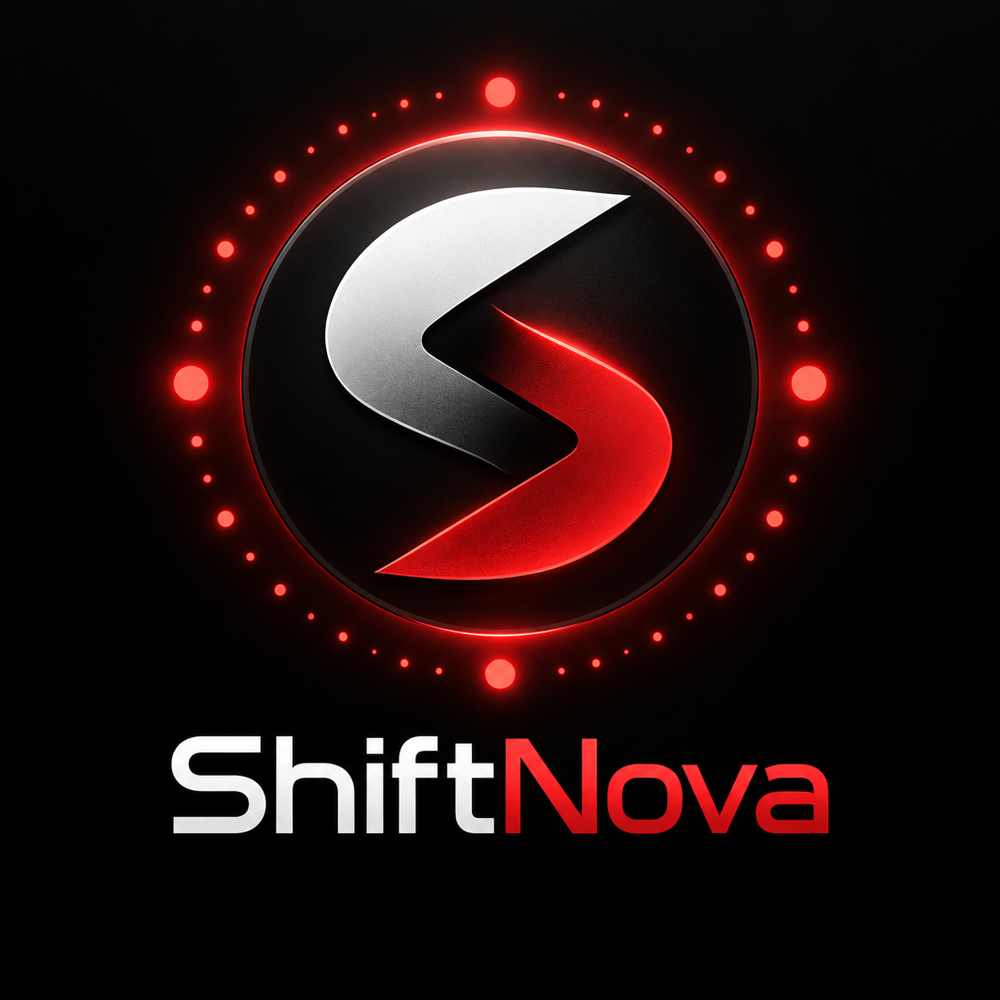

  

<h1 align="center">ShiftNova</h1>

  Una forma rápida de reconocer cada entorno, trabajar con colores más cómodos y usar modo oscuro sin alterar el sistema.

  
  
  

  <a href="https://github.com/danysers/ShiftNova/releases/latest"><strong>Descargar la última versión</strong></a>
  ·
  <a href="https://github.com/danysers/ShiftNova/issues">Informar un problema</a>

## ✨ ¿Para qué sirve?

ShiftNova es una extensión para personalizar la apariencia de cualquier página web mediante perfiles de color. Puedes crear una configuración diferente para cada sitio, elegir entre una vista clara u oscura y adaptar los tonos para trabajar con mayor comodidad.

En el ámbito laboral también puede utilizarse para identificar visualmente distintos entornos, por ejemplo desarrollo, pruebas y producción. Asignar un color a cada uno ayuda a reconocerlos de inmediato y a reducir confusiones, sin cambiar el funcionamiento ni el contenido de las páginas.

- 🎨 Asigna un color diferente a cada sitio o sección.
- 🌙 Incluye modo claro, oscuro, automático según el sistema y por horario.
- 👁️ Permite ajustar brillo, contraste, sepia y escala de grises.
- 🧩 Colorea fondos, cabeceras, menús, pestañas, grillas, formularios y ventanas de manera uniforme.
- 🖼️ Conserva los colores importantes de avisos, estados, iconos, imágenes y logotipos.
- 💾 Permite exportar tus perfiles e importarlos en otra computadora.
- 🔔 Comprueba si existe una versión nueva al abrir la extensión.

> [!IMPORTANT]
> ShiftNova sólo cambia la apariencia. No modifica datos, no crea registros y no realiza operaciones dentro de los sistemas.

## 🧭 Formas de usarlo

- Personaliza tus páginas habituales con colores más cómodos o fáciles de reconocer.
- Crea perfiles independientes para diferentes sitios o secciones de un mismo sitio.
- Asigna colores distintos a los entornos de desarrollo, pruebas y producción de tu lugar de trabajo.
- Usa el modo oscuro durante la noche y el modo claro durante el día.
- Comparte tu configuración exportándola e importándola en otra computadora.

Cada persona puede crear, editar o desactivar sus propios perfiles. Los sitios que no tengan un perfil habilitado se verán exactamente como antes.

## 📥 Instalación

ShiftNova funciona en **Windows, macOS y Linux**. La instalación es prácticamente igual en los tres sistemas: descarga el archivo, descomprímelo en una carpeta que no vayas a borrar y cárgalo desde el navegador.

### Google Chrome

1. Entra en [Última versión de ShiftNova](https://github.com/danysers/ShiftNova/releases/latest).
2. Descarga el archivo cuyo nombre comienza con `shiftnova-chromium` y termina en `.zip`.
3. Descomprime el archivo y guarda la carpeta resultante.
4. Escribe `chrome://extensions` en la barra de direcciones.
5. Activa **Modo de desarrollador**.
6. Pulsa **Cargar descomprimida** y selecciona la carpeta que guardaste.
7. Fija ShiftNova en la barra del navegador para tenerla siempre a mano.

### Microsoft Edge

1. Descarga y descomprime el paquete `shiftnova-chromium` desde la [última versión](https://github.com/danysers/ShiftNova/releases/latest).
2. Escribe `edge://extensions` en la barra de direcciones.
3. Activa **Modo de desarrollador**.
4. Pulsa **Cargar desempaquetada** y selecciona la carpeta descomprimida.

### Opera y Opera GX

1. Descarga y descomprime el paquete `shiftnova-chromium` desde la [última versión](https://github.com/danysers/ShiftNova/releases/latest).
2. Escribe `opera://extensions` en la barra de direcciones.
3. Activa **Modo de desarrollador**.
4. Pulsa **Cargar descomprimida** y selecciona la carpeta de ShiftNova.

### Mozilla Firefox y Firefox Developer Edition

Cuando una versión incluya un archivo `.xpi`, ábrelo con Firefox y confirma **Añadir**. El instalador público de Firefox requiere la firma de Mozilla; si el `.xpi` todavía no aparece en la descarga, esa versión está disponible por el momento para Chrome, Edge y Opera.

> [!NOTE]
> En Android y iPhone los navegadores no admiten este mismo método de instalación. La versión publicada está pensada para computadoras de escritorio.

## 🚀 Primeros pasos

1. Abre uno de los sitios configurados.
2. Pulsa el icono de ShiftNova en la barra del navegador.
3. Enciende el perfil del sitio.
4. Elige **Claro**, **Oscuro**, **Sistema** o **Horario**.
5. Cambia el color base si quieres identificar ese entorno con otro tono.

Desde el editor puedes crear perfiles, duplicarlos, cambiar su dirección, personalizar cada superficie o guardar una copia de tu configuración.

## 🔄 Cómo actualizar

ShiftNova te avisa en su propia ventana cuando encuentra una versión nueva.

1. Descarga el nuevo archivo desde el botón de actualización o desde [Releases](https://github.com/danysers/ShiftNova/releases/latest).
2. Descomprime el ZIP.
3. Reemplaza el contenido de la carpeta donde instalaste ShiftNova, sin cambiarla de ubicación.
4. Vuelve a la página de extensiones del navegador y pulsa **Recargar** sobre ShiftNova.

Tus perfiles y preferencias permanecerán guardados. También puedes exportarlos antes de actualizar si quieres conservar una copia adicional.

## 🛟 Si algo no se ve bien

- Comprueba que el perfil coincida con la dirección abierta y que esté habilitado.
- Recarga la página después de cambiar de modo o color.
- Si la ventana de ShiftNova queda oscura mientras eliges un color, ciérrala y vuelve a abrirla; el cambio aplicado al sitio no se pierde.
- Verifica que estés usando la [última versión disponible](https://github.com/danysers/ShiftNova/releases/latest).
- Si el problema continúa, abre un [nuevo reporte](https://github.com/danysers/ShiftNova/issues/new) e incluye una captura de pantalla y la dirección donde ocurrió.

## 🔒 Privacidad

ShiftNova trabaja dentro del navegador y guarda la configuración localmente. No incorpora publicidad, noticias, telemetría ni activación externa. La única conexión externa propia de la extensión se utiliza para consultar en GitHub si hay una actualización disponible.

## ❤️ Agradecimientos

ShiftNova nació inspirada en [Dark Reader](https://github.com/darkreader/darkreader), creado por **Alexander Shutau** y desarrollado junto con su comunidad de colaboradores. Agradecemos sinceramente ese trabajo, que hizo posible explorar una experiencia visual más cómoda y sirvió como punto de partida para este proyecto.

ShiftNova adapta partes de su motor de tematización, distribuidas bajo la licencia MIT, y construye sobre ellas una experiencia propia basada en perfiles de color para cualquier sitio web. El reconocimiento y los avisos correspondientes se conservan en el archivo [LICENSE](LICENSE).
